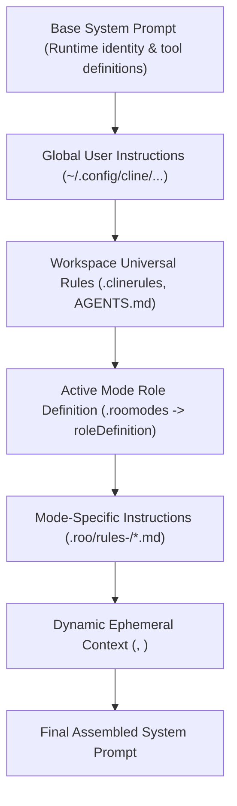
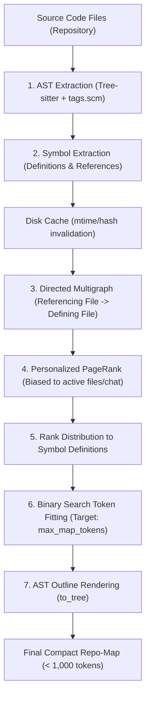

# Research: Extraction of Project Rules and Knowledge Systems from Cline and Aider

- **Date**: 2026-09-26
- **Ticket**: Resolves #69 (Part of Map #67: Persistent Project Memory Engine & Open-Source Tool Suite)
- **Status**: Complete / Authoritative Research
- **Relevant Subsystems**: Agent Runtime, `zeus_memory`, `zeus_search`, Prompt Pipeline, Tool Infrastructure
- **Security Invariants**: SEC-11 (Path Containment), SEC-14 (Crown Jewels Alignment), SEC-15 (Bound SQL Parameters), SEC-16 (Secret Redaction), SEC-19 (Three-Layer Permission Authority), XP-01 (Input/Output Caps)

---

## 1. Executive Summary & Comparative Matrix

Coding agents require durable guidance (project rules, conventions, architectural patterns) and structural awareness of codebases without exceeding finite LLM context windows or incurring severe token degradation. This research investigates how two leading open-source agent implementations solve this challenge:

1. **Cline (and Roo-Cline / Roo Code)**: Pioneers an extensible project rules hierarchy (`.clinerules`, `.roomodes`, mode-specific directories) and connects agents to external persistent memory via the Model Context Protocol (MCP stdio JSON-RPC).
2. **Aider**: Pioneered the **Tree-sitter Repository Map**, an algorithm combining AST symbol extraction (`tags.scm`), dependency graph construction, personalized PageRank on symbol references, and binary search token budget optimization to compress whole-repository architectural structure into < 1,000 tokens.

### Comparative Architectural Matrix

| Dimension | Cline / Roo Code | Aider | Existing ZEUS (Inherited) | ZEUS Recommended Target |
| :--- | :--- | :--- | :--- | :--- |
| **Project Rules System** | `.clinerules`, `.cursorrules`, `.roomodes` (JSON/YAML) with tool gating by mode | `.aider.conf.yml`, system prompts, conventions via markdown files | Dynamic `.cursor/rules/zeus-context.mdc` generated per run | Unified multi-tier rules: Workspace `.zeusrules` / `.clinerules` / `AGENTS.md` + Session ephemeral rules |
| **Persistent Memory Mechanism** | MCP Memory Servers (Knowledge Graph `@modelcontextprotocol/server-memory` or SQLite MCP) | Git history context, `/read`, `/add`, conversation cache | SQLite FTS5 database (`zeus.db`, `MemoryManager.ts`), read-only tools | Three-tier hybrid: Injected core memory + SQLite FTS5 tool suite (`memory_save`, `memory_recall`, `memory_forget`) |
| **Codebase Mapping** | `list_code_definition_names` (Tree-sitter top-level definitions per directory) | `repomap.py`: Tree-sitter AST tags + Directed Multigraph + Personalized PageRank + Binary Search | Local search index (BM25 files/symbols) + `find_files`, `search_project` | Wasm-based `web-tree-sitter` symbol outline + `list_directory_tree` + PageRank repo-map option |
| **Navigation & Discovery** | `list_files`, `list_code_definition_names`, `search_files` | Interactive `/map`, file auto-addition based on references | `find_files`, `search_project`, raw ripgrep/glob | `list_directory_tree` (compact ASCII tree) + `view_code_symbols` (AST outline) |
| **Token Budget Control** | Static system prompt sections; MCP server defines response size | Binary search against `max_map_tokens` (default 1024 tokens, 15% tolerance) | `retrieveForPrompt()` token limits, `MEMORY_LIMITS.promptBudget` | Adaptive token budgeting: binary search tree fitting + strict output line clamps (XP-01) |

---

## 2. Project Rules Systems: Cline & Roo Code

### 2.1 File Formats and Scopes

Cline and its fork Roo Code structure persistent instructions across four primary formats:

1. **`.clinerules` (Universal Workspace Rules)**:
   - Plain Markdown file located at the workspace root (`<root>/.clinerules`).
   - Also supports a modular directory layout: `<root>/.clinerules/*.md`, allowing separation of concerns (e.g. `architecture.md`, `testing.md`, `pr-review.md`).
   - Intended for project-wide conventions: lint rules, build instructions, architectural invariants, and code style.

2. **`.cursorrules` and `.cursor/rules/*.mdc` (Compatibility Layer)**:
   - Cline transparently detects `.cursorrules` and modern `.cursor/rules/*.mdc` files when `.clinerules` is not present, or combines them as secondary instructions.
   - MDC rules include YAML frontmatter:
     ```yaml
     ---
     description: Coding standards for API routes
     globs: ["src/api/**/*.ts"]
     alwaysApply: true
     ---
     ```

3. **`AGENTS.md` / `CLAUDE.md`**:
   - Industry-standard entry point files loaded recursively or at root.

4. **`.roomodes` (Custom Mode Definitions in Roo Code)**:
   - Root-level JSON or YAML file (`<root>/.roomodes`) specifying specialized personas, restricted tool permissions, and tailored instructions.
   - **Exact Schema**:
     ```yaml
     customModes:
       - slug: architect
         name: Software Architect
         roleDefinition: "You are a senior software architect specializing in distributed systems. Focus on interface design, system boundaries, and security invariants. Do not write full implementation code."
         groups:
           - read
           - mcp
         customInstructions: "Always propose Architecture Decision Records (ADRs) under docs/adr/ before approving major interface changes."
       - slug: tester
         name: Test Engineer
         roleDefinition: "You are a strict QA engineer focusing on unit and integration verification."
         groups:
           - read
           - edit
           - command
         customInstructions: "Enforce Test-Driven Development (TDD). Every bug fix must include a reproducing test before modifying source code."
     ```

5. **Mode-Specific Rule Directories**:
   - Scoped rule files located under `.roo/rules-<slug>/` or `.clinerules-<slug>/` (e.g. `.roo/rules-architect/boundaries.md`).
   - Loaded into context **only** when the agent is currently operating in that specific mode.

### 2.2 Precedence Hierarchy & Assembly Pipeline

The prompt assembly follows a strict deterministic order:



1. **Base System Prompt**: Core identity, tool XML/JSON schemas, and baseline safety rules.
2. **Global Custom Instructions**: User-level settings stored in IDE extension global storage (applies across all repositories).
3. **Workspace Universal Rules**: Extracted from `<root>/.clinerules` or `<root>/.clinerules/*.md`.
4. **Active Mode Role Definition**: Injected from the active mode's `roleDefinition` field.
5. **Mode-Specific Rules**: Files matching `.roo/rules-<mode>/*.md` or `.clinerules-<mode>/*`.
6. **Dynamic Ephemeral Context Rules**: Per-turn injections (e.g., ZEUS session context, active memory hits, working tree diffs).

### 2.3 Dynamic Rule Switching & File Watching

- **Mode Switching Lifecycle**: When a developer switches modes in the UI (e.g., `code` -> `architect`), the agent runtime:
  1. Re-filters the available tools against the mode's allowed `groups` (`read`, `edit`, `command`, `browser`, `mcp`). Mutating tools (`write_to_file`, `execute_command`) are completely omitted from the schema if not in `groups`.
  2. Clears the previous mode's `roleDefinition` and mode-specific rule text.
  3. Loads the new mode's rules and rebuilds the system prompt.
- **Hot Reloading via File Watchers**: Cline attaches VS Code `workspace.createFileSystemWatcher` (or `chokidar` in Node/Electron) to watch `.clinerules*`, `.roomodes`, and `.cursorrules`. Edits take effect on the very next turn without restarting the session.

---

## 3. Persistent Memory Systems & MCP Memory Servers

### 3.1 Knowledge Graph MCP (`@modelcontextprotocol/server-memory`)

The standard Anthropic MCP Memory Server implements an **Entity-Relationship-Observation** knowledge graph persisted to a JSON file (`MEMORY_FILE_PATH`).

#### Exact Tool Schemas & Signatures

```json
{
  "tools": [
    {
      "name": "create_entities",
      "description": "Create multiple new entities in the knowledge graph",
      "inputSchema": {
        "type": "object",
        "properties": {
          "entities": {
            "type": "array",
            "items": {
              "type": "object",
              "properties": {
                "name": { "type": "string", "description": "Unique name of the entity" },
                "entityType": { "type": "string", "description": "Type/category (e.g., service, model, convention)" },
                "observations": { "type": "array", "items": { "type": "string" }, "description": "Known facts" }
              },
              "required": ["name", "entityType", "observations"]
            }
          }
        },
        "required": ["entities"]
      }
    },
    {
      "name": "create_relations",
      "description": "Create multiple new relations between entities in the knowledge graph",
      "inputSchema": {
        "type": "object",
        "properties": {
          "relations": {
            "type": "array",
            "items": {
              "type": "object",
              "properties": {
                "from": { "type": "string", "description": "Source entity name" },
                "to": { "type": "string", "description": "Target entity name" },
                "relationType": { "type": "string", "description": "Active-voice relation (e.g., depends_on, calls, implements)" }
              },
              "required": ["from", "to", "relationType"]
            }
          }
        },
        "required": ["relations"]
      }
    },
    {
      "name": "add_observations",
      "description": "Add new observations to existing entities in the knowledge graph",
      "inputSchema": {
        "type": "object",
        "properties": {
          "observations": {
            "type": "array",
            "items": {
              "type": "object",
              "properties": {
                "entityName": { "type": "string", "description": "Name of the existing entity" },
                "contents": { "type": "array", "items": { "type": "string" }, "description": "New observations to append" }
              },
              "required": ["entityName", "contents"]
            }
          }
        },
        "required": ["observations"]
      }
    },
    {
      "name": "search_nodes",
      "description": "Search for nodes in the knowledge graph based on a query string matching names, types, or observations",
      "inputSchema": {
        "type": "object",
        "properties": {
          "query": { "type": "string", "description": "Search query" }
        },
        "required": ["query"]
      }
    },
    {
      "name": "open_nodes",
      "description": "Open specific nodes by name to inspect their observations and immediate relations",
      "inputSchema": {
        "type": "object",
        "properties": {
          "names": { "type": "array", "items": { "type": "string" }, "description": "Entity names to open" }
        },
        "required": ["names"]
      }
    },
    {
      "name": "read_graph",
      "description": "Read the entire knowledge graph (Warning: high token cost on large graphs)",
      "inputSchema": { "type": "object", "properties": {} }
    }
  ]
}
```

### 3.2 SQLite MCP Memory Servers vs. Knowledge Graph MCP

| Feature | Knowledge Graph MCP (`server-memory`) | SQLite MCP Memory Server (`mcp-memory-sqlite`) |
| :--- | :--- | :--- |
| **Storage Engine** | Flat JSON / JSONL file (`MEMORY_FILE_PATH`) | SQLite3 with Write-Ahead Logging (WAL) |
| **Search Mechanism** | Naive substring matching over entity and observation strings | SQLite FTS5 (Full-Text Search) with BM25 ranking |
| **Token Safety** | Dangerous: `read_graph` dumps the entire graph into LLM context | Safe: Enforces `LIMIT ?` and pagination on every query |
| **Concurrency & ACID** | Process file locks or in-memory array writeback; prone to corruption under race conditions | Robust ACID transactions, multiple readers + single writer via WAL |
| **Relational Filtering** | Graph traversal (1-hop via `open_nodes`) | Structured SQL filtering (`workspace_id`, `tier`, `confidence`, `tags`) |
| **Suitability for ZEUS** | High token overhead, unstructured ontology drift | **Direct fit**: Aligns with ZEUS's existing SQLite architecture (`zeus.db`, SEC-14, SEC-15) |

### 3.3 How Cline Connects Agents to Persistent Memory

1. **Configuration**: Configured in `cline_mcp_settings.json`:
   ```json
   {
     "mcpServers": {
       "memory": {
         "command": "npx",
         "args": ["-y", "@modelcontextprotocol/server-memory"],
         "env": { "MEMORY_FILE_PATH": ".zeus/memory.json" }
       }
     }
   }
   ```
2. **Transport**: stdio JSON-RPC. Cline launches the process as a child process and speaks JSON-RPC 2.0.
3. **Tool Ingestion**: Cline calls `tools/list` at startup, discovers the tools, and injects their definitions into the system prompt.
4. **Execution**: When the agent issues `<use_mcp_tool>`, Cline validates the call, executes it over stdio, and returns the result in the conversation history.

---

## 4. Aider's Tree-sitter Repo-Map Engine

Aider achieves whole-codebase awareness within < 1,000 tokens using its Tree-sitter Repository Map (`repomap.py`).

### 4.1 The 4-Stage Repo-Map Pipeline



### 4.2 Stage 1: Tree-sitter AST Symbol Extraction

Aider uses Tree-sitter and language-specific query files (`tags.scm`) to parse source files into definitions and references.

#### Tree-sitter Capture Conventions

- **Definitions**:
  - `@name.definition.class`: Classes, structs, interfaces.
  - `@name.definition.function`: Standalone functions.
  - `@name.definition.method`: Class/struct methods.
  - `@name.definition.module` / `@name.definition.interface`: Modules, protocols.
- **References**:
  - `@name.reference.call`: Function/method invocations.
  - `@name.reference.type`: Type annotations, interface implementations, base classes.
  - `@name.reference`: Generic identifier occurrences.

#### Example `tags.scm` (TypeScript/JavaScript Fragment)

```scheme
;; Function definitions
(function_declaration
  name: (identifier) @name.definition.function)

(lexical_declaration
  (variable_declarator
    name: (identifier) @name.definition.function
    value: [(arrow_function) (function_expression)]))

;; Class & Method definitions
(class_declaration
  name: (type_identifier) @name.definition.class)

(method_definition
  name: (property_identifier) @name.definition.method)

;; Function & Method calls (References)
(call_expression
  function: [(identifier) @name.reference.call
             (member_expression property: (property_identifier) @name.reference.call)])

;; Type references
(type_identifier) @name.reference.type
```

#### Caching Mechanism
AST extraction is computationally expensive. Aider caches extracted tags in a local SQLite database (`diskcache`). The cache key is:
$$\text{Key} = (\text{file\_rel\_path}, \text{mtime}, \text{file\_size}, \text{sha256\_hash})$$
If a file has not been modified on disk, parsing is skipped entirely.

### 4.3 Stage 2 & 3: Graph Construction and Personalized PageRank

#### Dependency Graph Construction
Aider maintains two lookup tables:
- `defines[ident] -> Set[file_path]` (which files define symbol `ident`)
- `references[ident] -> List[file_path]` (which files reference symbol `ident`)

It constructs a directed multigraph $G = (V, E)$ using NetworkX (`nx.MultiDiGraph`):
- **Nodes ($V$)**: All repository source file paths.
- **Edges ($E$)**: For every identifier $S$ present in both `defines` and `references`, an edge is added from the referencing file to the defining file:
  $$e = (F_{\text{ref}}, F_{\text{def}})$$
- **Edge Weighting**: To prevent ubiquitous identifiers (e.g., `id`, `name`, `get`, `toString`) from distorting the graph, edges are weighted inversely by the square root of the reference frequency:
  $$W(e) = \frac{1}{\sqrt{|\text{references}(S)|}}$$

#### Personalized PageRank (PPR) Formulation
Standard PageRank computes structural importance across the entire graph. Aider uses **Personalized PageRank** to bias the importance toward files relevant to the current user request:
$$\mathbf{r} = (1 - d) \mathbf{p} + d \mathbf{M} \mathbf{r}$$
Where:
- $\mathbf{r}$ is the resulting PageRank vector across all files.
- $d \approx 0.85$ is the damping factor.
- $\mathbf{M}$ is the column-stochastic transition matrix constructed from the weighted edges.
- $\mathbf{p}$ is the **personalization vector**:
  $$p(F) = \begin{cases} 
  1.0 & \text{if } F \in \text{ChatFiles} \cup \text{MentionedFiles} \\
  0.01 & \text{otherwise}
  \end{cases}$$
The vector is normalized such that $\sum_{F} p(F) = 1.0$.

#### Distributing File Rank to Definitions
Once each file has a PageRank score $r(F)$, Aider distributes that score to the definitions inside $F$:
$$\text{Rank}(\text{tag}_i) = r(F) \times \text{Multiplier}(\text{tag}_i)$$
Where `Multiplier` boosts classes, exported interfaces, and top-level functions over private helpers.

### 4.4 Stage 4: Binary Search Token Fitting & AST Tree Rendering

#### AST Outline Formatting (`to_tree`)
Aider formats the ranked tags into a hierarchical text skeleton:
1. Groups definitions by file path.
2. Formats enclosing classes and their inner methods.
3. Renders function/method headers (parameters, type hints, return types).
4. Elides implementation bodies with `...`.
5. Omits files already open in chat context to prevent redundant token consumption.

#### Example Output (`--show-repo-map` / `/map`)
```text
src/main/managers/memory/MemoryManager.ts:
│ export class MemoryManager {
│   constructor(db: Database, settings: SettingsManager)
│   retrieveForPrompt(ctx: RetrieveContext): MemoryHit[]
│   save(input: MemoryCreateInput): Memory
│   search(query: string, opts?: SearchOptions): MemoryHit[]
│   forget(id: string): boolean
│ }

src/main/managers/search/SearchManager.ts:
│ export class SearchManager {
│   globalSearch(query: string, opts?: GlobalSearchOptions): SearchGroup[]
│   findFiles(pattern: string): string[]
│ }
```

#### Binary Search Algorithm on Token Budget
Given a token budget $B = \text{max\_map\_tokens}$ (default: $1,024$, max: $4,096$):

```python
def get_ranked_tags_map(self, chat_fnames, other_fnames, max_map_tokens):
    ranked_tags = self.get_ranked_tags(chat_fnames, other_fnames)
    
    # Binary search bounds
    low = 0
    high = len(ranked_tags)
    best_tree = ""
    
    while low < high:
        mid = (low + high) // 2
        candidate_tags = ranked_tags[:mid]
        candidate_tree = self.to_tree(candidate_tags, chat_fnames)
        token_count = self.token_counter(candidate_tree)
        
        # Check if within 15% tolerance of target budget
        if 0.85 * max_map_tokens <= token_count <= max_map_tokens:
            return candidate_tree
            
        if token_count > max_map_tokens:
            high = mid
        else:
            best_tree = candidate_tree
            low = mid + 1
            
    return best_tree
```

---

## 5. Code Navigation Tools: Specifications & Schemas

### 5.1 Tool 1: Compact Directory Tree (`list_directory_tree`)

Provides the agent with an immediate overview of project layout without flooding context.

#### Engineering Constraints
1. **Depth Clamping**: Default depth = 2, max depth = 4.
2. **Gitignore Awareness**: Honors `.gitignore`, `.git`, `node_modules`, `dist`, `target`, `.zeus`.
3. **Output Caps (XP-01)**: Max 120 lines or 6 KiB buffer. If directory exceeds cap, truncates with `[... N entries hidden]`.

#### JSON Schema & TypeScript Definition

```typescript
export interface ListDirectoryTreeArgs {
  path?: string;         // Relative workspace path (default: ".")
  maxDepth?: number;     // 1 to 4 (default: 2)
  includeHidden?: boolean; // Show dotfiles (default: false)
}

export const listDirectoryTreeSchema = {
  name: 'list_directory_tree',
  description:
    'Display a compact, depth-bounded ASCII directory tree of the workspace. ' +
    'Honors .gitignore and hides vendor directories. Use this first to understand ' +
    'folder layout before searching or reading files.',
  inputSchema: {
    type: 'object',
    properties: {
      path: {
        type: 'string',
        description: 'Directory path relative to workspace root (default: ".").'
      },
      maxDepth: {
        type: 'number',
        minimum: 1,
        maximum: 4,
        description: 'Maximum traversal depth (default: 2).'
      },
      includeHidden: {
        type: 'boolean',
        description: 'Include hidden files/directories (default: false).'
      }
    }
  }
};
```

#### Example Output
```text
.
├── src/
│   ├── main/
│   │   ├── db/ (3 files)
│   │   ├── ipc/ (12 files)
│   │   ├── managers/ (18 files)
│   │   └── index.ts
│   ├── preload/
│   │   └── index.ts
│   └── renderer/
│       ├── components/ (24 files)
│       ├── stores/ (8 files)
│       └── App.tsx
├── package.json
├── tsconfig.json
└── vite.config.mts
(Summary: 6 directories, 4 root files; vendor/build artifacts excluded)
```

---

## 5.2 Tool 2: Symbol Extraction & AST Outline (`view_code_symbols`)

Extracts top-level declarations and signatures from a single file or directory without returning implementation bodies.

#### Technology Choice: `web-tree-sitter` (Wasm) vs. Native `tree-sitter`
- **Native `tree-sitter`**: Requires native node-gyp bindings, C++ compiler toolchains during install, and OS-specific binary distribution. Known to cause severe build failures on Windows developer machines.
- **`web-tree-sitter` (WebAssembly)**: Runs precompiled `.wasm` grammars in pure Node / Electron without native compilation. **Recommended for ZEUS** to guarantee 100% Windows and cross-platform hermetic execution.

#### JSON Schema & TypeScript Definition

```typescript
export interface ViewCodeSymbolsArgs {
  path: string;            // File or directory relative path
  includePrivate?: boolean;// Include unexported/private members (default: false)
}

export const viewCodeSymbolsSchema = {
  name: 'view_code_symbols',
  description:
    'Extract high-level code symbols (classes, interfaces, functions, methods, types) ' +
    'and their signatures from a file or directory using Tree-sitter AST parsing. ' +
    'Implementation bodies are omitted. Use this to inspect APIs without loading full files.',
  inputSchema: {
    type: 'object',
    properties: {
      path: {
        type: 'string',
        description: 'Relative path to a file or directory.'
      },
      includePrivate: {
        type: 'boolean',
        description: 'Include private/unexported symbols (default: false).'
      }
    },
    required: ['path']
  }
};
```

#### Example Output
```text
Symbols for src/main/managers/memory/MemoryManager.ts:

[Class] MemoryManager (line 120)
  ├── [Method] constructor(db: Database, settings: SettingsManager) (line 125)
  ├── [Method] save(input: MemoryCreateInput): Memory (line 184)
  ├── [Method] recall(query: string, opts?: RecallOptions): MemoryHit[] (line 240)
  ├── [Method] forget(id: string): boolean (line 310)
  └── [Method] list(filter: MemoryListFilter): Memory[] (line 345)

[Interface] MemoryCreateInput (line 42)
  ├── workspaceId?: string | null
  ├── tier: MemoryTier
  ├── title: string
  └── body: string

[Type] MemoryTier (line 18)
  └── 'decision' | 'convention' | 'preference' | 'solution' | 'note' | 'workspace' | 'session'
```

---

## 6. Actionable Blueprint for ZEUS Implementation

### 6.1 Enhancing `zeus_memory` (Tickets #70, #71)

ZEUS currently has a read-only memory implementation (`MemoryManager.ts`, `memoryTools.ts` with `list_memories`, `search_memories`). Tickets #70 and #71 require expanding this into a full persistent memory engine.

#### 1. SQLite Schema Evolution (`zeus_project_memories`)
Store in `zeus.db` (enforcing SEC-14 Crown Jewels, SEC-15 parameterized queries):

```sql
CREATE TABLE IF NOT EXISTS zeus_project_memories (
  id TEXT PRIMARY KEY NOT NULL,
  workspace_id TEXT,                    -- NULL indicates global user memory
  tier TEXT NOT NULL,                   -- 'decision', 'convention', 'preference', 'solution', 'note'
  title TEXT NOT NULL,
  body TEXT NOT NULL,
  source TEXT NOT NULL DEFAULT 'agent', -- 'manual', 'agent', 'commit', 'conversation'
  confidence REAL NOT NULL DEFAULT 1.0, -- 0.0 to 1.0
  pinned INTEGER NOT NULL DEFAULT 0,    -- 0 or 1
  status TEXT NOT NULL DEFAULT 'active',-- 'active', 'archived', 'pending_proposal'
  use_count INTEGER NOT NULL DEFAULT 0,
  last_used_at INTEGER,
  created_at INTEGER NOT NULL,
  updated_at INTEGER NOT NULL,
  expires_at INTEGER,
  file_path TEXT,                       -- Associated file if scoped to a module
  meta TEXT NOT NULL DEFAULT '{}'       -- JSON metadata (prototype-pollution guarded)
);

-- Full-Text Search index (BM25)
CREATE VIRTUAL TABLE IF NOT EXISTS zeus_project_memories_fts USING fts5(
  title,
  body,
  content='zeus_project_memories',
  content_rowid='rowid'
);
```

#### 2. Native Memory Tool Suite (Ticket #71)

Implement the full mutable tool suite as transport-neutral `PlainTool`s in `memoryTools.ts`:

1. `memory_save`:
   - Inputs: `{ tier: MemoryTier, title: string, body: string, filePath?: string, pinned?: boolean }`
   - Action: Inserts or updates memory in `zeus_project_memories`, updates FTS5 index.
   - Permission: In `plan` or `ask` mode, creates a pending proposal; in `default` / `acceptEdits`, saves directly.
2. `memory_recall`:
   - Inputs: `{ query: string, tier?: MemoryTier, limit?: number }`
   - Action: Executes BM25 FTS5 query combined with tier importance weighting.
3. `memory_forget`:
   - Inputs: `{ id: string }`
   - Action: Sets `status = 'archived'` or deletes row, removes from FTS5 index.

### 6.2 Extended Navigation Tools Blueprint (Ticket #72)

1. **Register in `zeus_search` Tool Server**:
   Rather than creating a new tool server, mount `list_directory_tree` and `view_code_symbols` inside `searchPlainTools()` in `src/main/managers/search/searchTools.ts`. This immediately inherits:
   - Observation instrumentation (`observePlainTools`).
   - SDK in-process server registration for Claude sessions.
   - Stdio bridge dispatch for Cursor sessions.
   - Auto-approval in `AgentManager` (both tools are strictly read-only).
2. **Security Verification**:
   - `SEC-11` & `SEC-12`: All paths verified with `assertInsideRepo()` / `isInsideRoot()`.
   - `XP-01`: Output line caps (120 lines max) and character limits (8,192 chars max).
   - Read-only shell allowlist parity: Tool is in-process Node, zero shell strings (`SEC-08`).

---

## 7. Next Steps & Ticket Unblocking

With this research established:
1. **Unblocks Ticket #70** ("Decision: SQLite Schema & Storage Layer for zeus_project_memories"):
   - Adopt the parameterized SQLite FTS5 table definition above.
   - Enforce WAL mode and `better-sqlite3` bound statements (SEC-15).
2. **Unblocks Ticket #71** ("Decision: Native Memory Tool Specification"):
   - Implement `memory_save`, `memory_recall`, and `memory_forget` specifications following the `PlainTool` pattern.
3. **Unblocks Ticket #72** ("Decision: Extended Code Navigation Tools"):
   - Implement `list_directory_tree` and `view_code_symbols` using `web-tree-sitter` in `src/main/managers/search/`.
